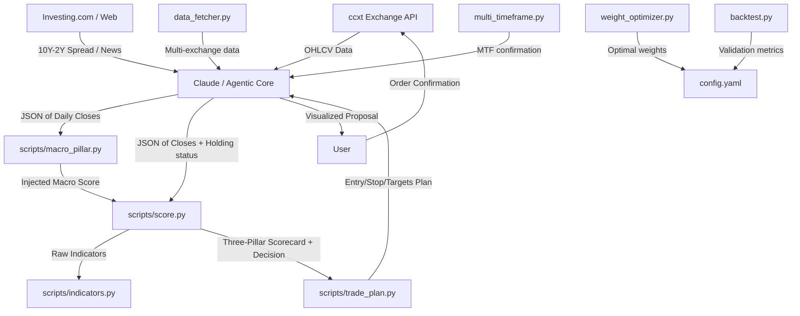

# Agentic Trading Desk

Personal trading desk for technical analysis and short-term portfolio management on stocks and ETFs. The system combines the automation and query capabilities of an Artificial Intelligence agent (via Robinhood MCP protocol) with local deterministic mathematical calculation engines in Python.

The ruling principle is: **the AI fetches data and interacts with the user; the scripts perform the deterministic calculations; the user decides and approves execution.**

---

## 🚀 Project Architecture

The project is designed to operate locally and modularly. All technical indicator computations are delegated to Python 3 scripts that only use the Python standard library (`stdlib`), ensuring speed and zero network dependencies during execution (except `data_fetcher.py` which requires ccxt for exchange connectivity).



### Architecture Improvements Over Original
* **Multi-exchange support** via ccxt — no longer tied to Robinhood
* **BIST/Borsa Istanbul** support for Turkish market analysis
* **Config-driven weights** in `config.yaml` instead of hardcoded values
* **Weight optimization** loop — optimizer finds best pillar weights, writes back to config
* **Multi-timeframe confirmation** prevents false signals from single-TF noise
* **Structured trade plans** with position sizing, stop loss, and take profit targets
* **Backtesting pipeline** for validating weight combinations before live deployment

### File Structure
*   **[SKILL.md](SKILL.md)**: Operations manual and specific guardrails guiding the AI agent's actions.
*   **[config.yaml](config.yaml)**: All pillar weights, scoring thresholds, and data fetcher settings.
*   **[requirements.txt](requirements.txt)**: External dependencies (ccxt, pyyaml).
*   **[scripts/indicators.py](scripts/indicators.py)**: Mathematical engine to calculate technical indicators without visual estimations.
*   **[scripts/macro_pillar.py](scripts/macro_pillar.py)**: Macro regime detector and cross-asset sentiment scorer.
*   **[scripts/score.py](scripts/score.py)**: Evaluator of the three-pillar framework and exit/entry decision engine.
*   **[scripts/data_fetcher.py](scripts/data_fetcher.py)**: Universal data fetcher using ccxt for multi-exchange support (Binance, Coinbase, Kraken, BIST).
*   **[scripts/multi_timeframe.py](scripts/multi_timeframe.py)**: Multi-timeframe confirmation engine — analyzes trend alignment across timeframes.
*   **[scripts/trade_plan.py](scripts/trade_plan.py)**: Structured trade plan generator — entry/stop/targets with position sizing and risk management.
*   **[scripts/weight_optimizer.py](scripts/weight_optimizer.py)**: Hyperopt-style weight optimizer — grid/random search for optimal pillar weights.
*   **[scripts/backtest.py](scripts/backtest.py)**: Walk-forward backtesting engine — Sharpe, Sortino, max drawdown, profit factor metrics.
*   **[scripts/scoring_engine.py](scripts/scoring_engine.py)**: 7-component scoring engine for BIST AI Trader v1.0 (Trend/Momentum/Volume/EMA/Pivot/Volatility/Tech Summary + penalties).
*   **[scripts/notification_router.py](scripts/notification_router.py)**: Tiered alert system — strong buy / watchlist / no-trade based on score thresholds.
*   **[scripts/eod_module.py](scripts/eod_module.py)**: End-of-Day PnL tracking with SQLite database — win rates, drawdowns, trade logs.
*   **[scripts/learning_module.py](scripts/learning_module.py)**: Auto-weight adjustment every 50 trades — analyzes feature performance and recommends weight updates.
*   **[scripts/orchestrator.py](scripts/orchestrator.py)**: Full pipeline orchestrator — chains all modules for daily automated BIST scans.

---

## 📈 The Three-Pillar Framework

Each analyzed asset is scored in three independent categories with scores from **-2 to +2** (for a consolidated total range of **-6 to +6**):

### 1. Trend
Determined in [scripts/score.py](scripts/score.py#L30) using:
*   Price position relative to the **EMA 20**.
*   Structural crossovers between exponential moving averages: **EMA 20 > EMA 50** and **EMA 50 > EMA 200**.
*   Slope direction of the **EMA 200** (measured relative to 5 bars ago).

### 2. Momentum
Determined in [scripts/score.py](scripts/score.py#L58) combining:
*   **RSI-14** using **Wilder's** smoothing (neutral zone from 45 to 55).
*   Sign of the **MACD (12, 26, 9)** histogram.
*   **TRIX-15** (triple EMA rate of change) compared against its EMA-9 signal line.

**Bollinger Bands** (20/2, population σ) are also computed and used as a supporting exhaustion signal (`%B ≥ 1` flags price at/above the upper band) but do not feed into the numeric momentum score.

### 3. Macro-Sentiment (Macro Environment)
Calculated by the [scripts/macro_pillar.py](scripts/macro_pillar.py) cross-asset analysis script, which weights the following components:
*   **Market Concentration**: RSP/SPY (equal-weight vs. cap-weight S&P 500).
*   **Yield Curve**: 10Y-2Y treasury yield spread (injected from Investing.com).
*   **Corporate Credit**: HYG/LQD ratio (high-yield vs. investment-grade).
*   **Size Factor**: IWM/SPY ratio (small caps vs. large caps).
*   **Asset Preference**: SPY/TLT ratio (equities vs. bonds).
*   **Sector Rotation**: XLY/XLP ratio (cyclical vs. defensive sectors).
*   **Inflationary Correlation**: Rolling SPY-TLT correlation.

---

## 🛠️ Script Usage

The scripts are run via the command line consuming data in JSON format.

### 1. Raw Indicators Computation
To obtain the detailed breakdown of all calculated indicators for an asset:
```bash
python3 scripts/indicators.py input_ticker.json
```
*Expected format for `input_ticker.json`:*
```json
{
  "close": [100.5, 101.2, 102.0, 101.8, 103.1, ...]
}
```

### 2. Macro-Sentiment Scoring
To calculate the regime and macro pillar of the session:
```bash
python3 scripts/macro_pillar.py macro_input.json --json
```
*Expected format for `macro_input.json`:*
```json
{
  "as_of": "2026-07-02",
  "yield_spread": -0.15,
  "series": {
    "SPY": [450.1, 452.3, ...],
    "RSP": [152.0, 151.8, ...],
    "IWM": [198.5, ...],
    "HYG": [...],
    "LQD": [...],
    "TLT": [...],
    "XLY": [...],
    "XLP": [...]
  }
}
```

### 3. Ticker Scoring and Decision
To obtain the complete three-pillar scorecard and action suggestion for the Agentic account:
```bash
python3 scripts/score.py ticker_input.json        # human-readable table
python3 scripts/score.py ticker_input.json --json  # machine-readable output
python3 scripts/score.py                           # self-test with synthetic data
```

### 4. Multi-Exchange Data Fetching (NEW)
Universal data fetcher using ccxt for any exchange:
```bash
# Single symbol
python3 scripts/data_fetcher.py BINANCE BTC/USDT 1d --json

# BIST stock
python3 scripts/data_fetcher.py mexc THYAO/TRY 1d --json

# All macro ETFs at once
python3 scripts/data_fetcher.py binance SPY/USD 1d --macro
```

### 5. Multi-Timeframe Confirmation (NEW)
Analyze trend alignment across multiple timeframes:
```bash
cat mtf_input.json | python3 scripts/multi_timeframe.py --stdin
```
*Input format:*
```json
{
  "symbol": "BTC/USDT",
  "timeframes": {
    "1d": [close_prices...],
    "4h": [close_prices...],
    "15m": [close_prices...]
  }
}
```

### 6. Trade Plan Generator (NEW)
Generate structured trade plans with entry/stop/targets:
```bash
python3 scripts/trade_plan.py --score scorecard.json --capital 10000
python3 scripts/trade_plan.py --stdin < scorecard.json
```

### 7. Weight Optimizer (NEW)
Find optimal pillar weights via grid or random search:
```bash
# Grid search over weight combinations
python3 scripts/weight_optimizer.py --mode grid \
    --input history.json --output best_weights.json

# Random search with target Sharpe ratio
python3 scripts/weight_optimizer.py --mode optimize \
    --input history.json --iterations 1000 --target-sharpe 1.5
```

### 8. Backtesting Engine (NEW)
Walk-forward backtesting with slippage and commission:
```bash
python3 scripts/backtest.py --input bars.json \
    --weights trend=0.4 momentum=0.35 macro_sentiment=0.25 \
    --capital 10000 --output results.json
```

*Output includes:* Sharpe ratio, Sortino ratio, max drawdown, win rate, profit factor, Calmar ratio, and detailed trade statistics.

### 9. Configuration (NEW)
All weights and parameters are now in `config.yaml`:
```yaml
pillar_weights:
  trend: 0.40
  momentum: 0.35
  macro_sentiment: 0.25
# ... see config.yaml for full options

data_fetcher:
  default_exchange: "binance"
  default_timeframe: "1d"
```
*Expected format for `ticker_input.json`:*
```json
{
  "symbol": "AAPL",
  "close": [220.5, 222.1, 221.8, ...],
  "macro_score": 1,
  "holding": true
}
```

The output includes the three-pillar scorecard, active flags (exhaustion / bearish / rebound / death-cross), and one of the following decisions:

| Decision | Context |
|---|---|
| `EXIT / TRIM` | Holding — bullish momentum exhausted |
| `EXIT` | Holding — bearish momentum relentless |
| `RE-ENTRY (new cycle)` | Flat — rebound with healthy EMA structure |
| `TACTICAL REBOUND (counter-trend)` | Flat — rebound inside a death-cross (reduced size, tight stop) |
| `HOLD (ride the cycle)` | Holding — trend and momentum positive |
| `HOLD (under review)` | Holding — weak signals, no full exit trigger yet |
| `WAIT (do not chase)` | Flat — healthy trend but no fresh entry trigger |
| `STAY OUT / AVOID` | Flat — relentless bearish, no rebound |
| `HOLD / OBSERVE` or `OBSERVE` | Mixed signals — no action, watch next close |

Before selecting a decision, the script detects **flags** — specific indicator patterns that signal exhaustion (e.g., RSI turning from overbought, MACD histogram shrinking), bearish persistence, or rebound triggers. The decision cascade prioritizes exit triggers for holders and entry triggers for flat positions. When `macro_score ≤ -1`, the framing is adjusted (tighter targets, reduced size) but the numeric pillar scores remain unchanged.

---

## 🤖 Claude Code Integration

To use this project as a **Skill** with Claude Code for automated trading analysis:

### 1. Add the Skill
Place the `SKILL.md` file in your Claude Code skills directory (typically `~/.claude/code/skills/`):
```bash
# Clone or copy this repository to your skills folder
cp -r /path/to/agentic-trading-desk ~/.claude/code/skills/agentic-trading-desk
```

Or reference it directly from this repository.

### 2. Agent Operation
Once loaded, Claude Code will:
* Automatically use this skill when you ask to analyze tickers, review positions, or make trading decisions
* Fetch data via Robinhood MCP protocol
* Call the Python scripts (`scripts/indicators.py`, `scripts/score.py`, `scripts/macro_pillar.py`) for deterministic calculations
* Present the three-pillar scorecard with actionable decisions
* **Never execute orders without your explicit confirmation**

### 3. Example Workflow
```
You: "Analyze AAPL for a potential entry"

1. Data Fetching (Robinhood MCP)
   → Fetches AAPL daily historicals (~290 bars for EMA 200)
   → Fetches live quote (current price / last close)
   → Checks if there is an open position → sets holding = true/false

2. Macro Pillar (once per session, shared across all tickers)
   → Fetches historicals for 7 ETFs: SPY, RSP, IWM, HYG, LQD, TLT, XLY, XLP
   → Retrieves 10Y-2Y yield spread from Investing.com
   → Runs: python3 scripts/macro_pillar.py → macro_score (-2 to +2)

3. Ticker Scoring
   → Assembles JSON with {symbol, close, macro_score, holding}
   → Runs: python3 scripts/score.py → three-pillar scorecard + decision
     (score.py calls indicators.py internally for all calculations)

4. Qualitative Context (reinforcement, does not alter scores)
   → News and macro context from Investing.com
   → Analyst consensus and price targets from Google Finance

5. Presentation and Confirmation
   → Returns: Scorecard, flags, and suggested action (RE-ENTRY, HOLD, EXIT, etc.)
   → You review and confirm before any order execution
```

The agent operates under the principle: **AI fetches data and presents analysis; scripts perform deterministic calculations; you decide and approve all executions.**

---

## 📰 External Qualitative Context (Reinforcement)

To complement the purely technical nature of the deterministic scripts, the AI agent integrates a real-time **qualitative reinforcement analysis** before presenting the final recommendation:

1.  **News and Macro**: Dynamically retrieved from **Investing.com** (validated source to avoid prompt injection risks).
2.  **Analyst Consensus and Reports**: Queries **Google Finance Beta** (`https://www.google.com/finance/beta/quote/<TICKER>:<EXCHANGE>?tab=analysis`) to extract:
    *   Overall consensus (*Buy/Hold/Sell*).
    *   12-month price targets (average, maximum, minimum) contrasted against the current price of the ticker.
    *   Recent earnings results (actual vs. estimated).
    *   Recent analyst rating changes (< 2 weeks).

*Note: This information is presented to the user alongside the three-pillar scorecard as interpretive context; **it does not directly alter** the mathematical score returned by the scripts, ensuring that quantitative triggers and risk management remain 100% deterministic.*

---

## 🛡️ Guardrails and Operation (Non-Negotiable)

1.  **Special Position Protection**: Certain positions can be designated as *protected* (e.g., restricted stock grants). Protected tickers are never evaluated for selling or trimming in exit suggestions.
2.  **Account Segregation**:
    *   **Agentic** (Cash Account): Oriented toward fast returns and capital rotation via tactical trades and defined cycles.
    *   **Individual** (Margin Account): Core passive long-term investing.
3.  **T+1 Liquidity**: In the cash account, only settled capital counts as buying power before placing buy orders.
4.  **Mandatory Confirmation**: Every order proposed by the bot must pass through a simulation check with `review_*_order` and be approved by the user before executing `place_*_order`.

---

## 🧠 BIST AI Trader v1.0 — Full Autonomous Agent Pipeline

A separate pipeline for Bursa Istanbul (BIST) stock analysis, per the v1.0 spec: every trading day at 08:45, scan BIST50 stocks → compute technical features → score each on a 0–100 scale → select top 2 → generate trade plans → end-of-day PnL tracking → auto-weight optimization every 50 trades.

### Architecture

```
Data Collector (ccxt)
    ↓ Feature Engine (RSI/MACD/EMA/Pivot/Volume per symbol)
        ↓ Scoring Engine (7-component weighted formula + penalties)
            ↓ Selection Engine (Top-2 picks, NO TRADE DAY fallback)
                ↓ Trade Plan Generator (entry/stop/target/risk-reward JSON)
                    ↓ Notification Router (tiered: strong buy / watchlist / no-trade)
                        ↓ EOD Module (PnL database, win-rate tracking)
                            ↓ Learning Module (auto-weight adjustment after 50 trades)
```

### New Scripts

| Script | Purpose |
|--------|---------|
| `scoring_engine.py` | 7-component scoring: Trend(25)+Momentum(20)+Volume(15)+EMA Structure(15)+Pivot Position(10)+Volatility(10)+Technical Summary(5). Penalty system for RSI extremes, low volume, bearish EMA. |
| `notification_router.py` | Tiered alerts: >85 = strong buy signal, 70–85 = watchlist, <70 = no trade. |
| `eod_module.py` | End-of-Day PnL tracking via SQLite database. Records entry/exit/PnL/win-rate per symbol per date. Generates daily performance reports. |
| `learning_module.py` | Every 50 completed trades: analyzes which features (RSI range, EMA structure, volume spike) produce best outcomes and recommends weight adjustments. |
| `orchestrator.py` | Full pipeline orchestrator — chains all modules in one run. Use for daily automated scans. |

### Usage

```bash
# Full daily scan (runs all 7 stages)
python3 scripts/orchestrator.py \
    --symbols EREGL.IS TUPRS.IS GARAN.IS THYAO.IS \
    --output-dir ./outputs/

# Scoring engine standalone (for testing)
echo '[{"symbol":"EREGL","close":42,"ema20":41.5,"ema50":40,"rsi":62,"macd":0.3,"macd_signal":0.2,"volume":5e7,"high":42.5,"low":41}]' | python3 scripts/scoring_engine.py -i /dev/stdin

# Notification routing
python3 scripts/notification_router.py -i outputs/scores.json -o outputs/notifications.json

# End-of-Day report
python3 scripts/eod_module.py --db data/trades.db

# Learning module (auto-weight adjustment)
python3 scripts/learning_module.py --db data/trades.db
```

### Scoring Formula (7 Components, 0–100 scale)

| Component | Max Points | Description |
|-----------|------------|-------------|
| Trend | 25 | EMA alignment + price position |
| Momentum | 20 | RSI zone + MACD cross |
| Volume | 15 | Volume vs 20-day average |
| EMA Structure | 15 | Clean bullish stack + pullback entry detection |
| Pivot Position | 10 | Support/resistance bounce opportunity |
| Volatility | 10 | Optimal intraday range (ATR-like) |
| Technical Summary | 5 | Candlestick patterns (hammer, strong close) |

### Penalty System

| Condition | Penalty |
|-----------|---------|
| RSI > 80 (overbought) | -10 |
| RSI < 35 (oversold) | -10 |
| Volume < 60% of 20-day avg | -10 |
| EMA20 < EMA50 (bearish structure) | -20 |

### Selection Logic

- Stocks scoring ≥ 80 → candidate for top picks
- Top 2 by score selected
- Fewer than 2 qualify → "NO TRADE DAY" flag set
